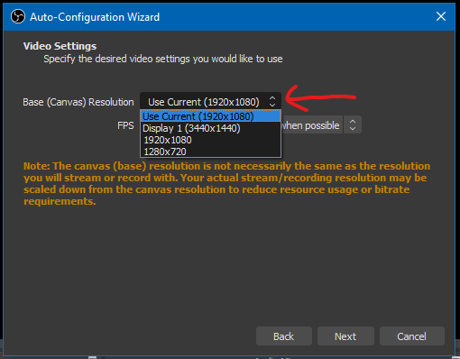

# Introduction
This document tells you how to install OBS Studio, how to configure it initially, how to add [Scenes](#setup-scenes) and [Sources](#setup-input-devices-per-scene). I highly recommend reading this and then following the example [here](example.md)

# Install
> Install this on whatever computer you will be streaming from and is connected to the camera / sound.

Navigate to [https://obsproject.com/](https://obsproject.com/) and click on the operating system you are using.

This will prompt you to save the file.

Once the file has finished downloading, open / run it by double clicking on the file

Just click `next` through all of the dialogs, and once it finishes, open `OBS Studio`.

# Configure It
1. The first time you open `OBS Studio` it will present you with a dialog to Auto configure the program. Click `yes`.

2. On the next window, make sure `optimize for streaming, recording is secondary` is selected, then click `next`

3. On the next window, you are presented with two options to change your preferred resolution and the preferred framerate. The default values should be fine (and you can change them later), but if you want to change them now here are the options:

> Base (Canvas) Resolution

1920x1080 is the default resolution for any HD display. Almost all TV's, laptop screens, and monitors use this resolution. If your internet connection is having trouble (we can test this), you might want to scale this down (select a lower resolution). It looks like the only other option is 1280x720, which will make the image blurrier but the stream will not buffer as much with that.

> FPS (stands for Frames Per Second)

Again this is an optimization option. If your internet connection can't handle your stream you should consider lowering this. This allows you to choose whether you prefer a nicer looking video or a smoother looking video (better details vs. less stuttering). 

4. On the next window, select the service (I believe you wanted `YouTube`), and ignore the rest for now. Go ahead and click next

5. This last window just shows you the hardware information `OBS` picked up, go ahead and click `Apply Settings`

# Setup Scenes
If you need to transition between something on the computer (like title cards or lyrics) or different cameras, you will need to setup a `Scene` for each of these configurations. A `Scene` is basically a folder for input devices.

On the bottom left of your screen, in the `Scenes` panel, you can click the plus icon to add a scene. Name each scene something helpful (like *desktop*, *title cards*, *left camera*, *title card overlay camera*, etc.).

> `OBS` always requires at least one scene, so even if you don't use this feature just leave that scene there. You can rename any scene to something helpful by right-clicking on the scene and clicking `Rename`

# Setup input devices (per scene)
A `Scene` acts as a folder for input devices, and you can transition between these folders.

In the bottom left-ish of `OBS` there is a `Sources` box. The plus icon will be where you add all of your inputs.

## Add a camera
> All of the options can be reconfigured later, don't worry if something doesn't work right the first time

To add a camera, click the plus icon, and select `Video Capture Device`

It will ask you to either select `Create New` or `Add Existing`. Keep `Create New` selected. This is basically just a name you set for the device in `OBS`. Call it whatever you want (like *streaming camera*) and click `OK`

On the next screen, it will present you with a preview (where the black box is in my screenshot) and give you a bunch of options. 

1. First, make sure the proper input device is selected. The preview will update based on which device you select, so just make sure whatever camera you are using for streaming is selected here.

2. If the red box in the background is **not** the full size of the black box (like in the screenshot below), select a `Resolution/FPS Type` of `Custom` and a `Resolution` of whatever you selected during configuration (probably `1920x1080`).

> Example of mismatched resolution

> How to fix it

3. **If** you are using that camera's microphone as the audio input, scroll down to `Audio Output Mode` and make sure `Capture Audio Only` is selected. If you are using a different microphone, go to step **4**

4. **If** you are using a different microphone than the one built in to the camera, check the box next to `Use custom audio device` and select your microphone from the dropdown. 

5. Finally, click `OK`

## Add a window from your computer (like PowerPoint)

Now that everything is setup