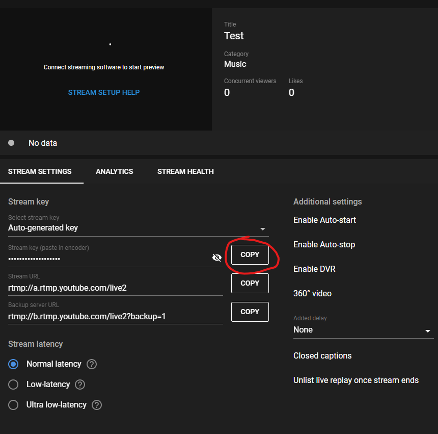

# Introduction
This document tells you how to install OBS Studio, how to configure it initially, how to add [Scenes](#setup-scenes) and [Sources](#setup-input-devices-per-scene). After configuring `OBS` the document presents you with an example. Feel free to call / text me if anything is unclear.

# Install
> Install this on whatever computer you will be streaming from and is connected to the camera / sound.

Navigate to [https://obsproject.com/](https://obsproject.com/) and click on the operating system you are using.

This will prompt you to save the file.

Once the file has finished downloading, open / run it by double clicking on the file

Just click `next` through all of the dialogs, and once it finishes, open `OBS Studio`.

# Configure It
1. The first time you open `OBS Studio` it will present you with a dialog to Auto configure the program. Click `yes`.

2. On the next window, make sure `optimize for streaming, recording is secondary` is selected, then click `next`

3. On the next window, you are presented with two options to change your preferred resolution and the preferred framerate. The default values should be fine (and you can change them later), but if you want to change them now here are the options:

> Base (Canvas) Resolution

1920x1080 is the default resolution for any HD display. Almost all TV's, laptop screens, and monitors use this resolution. If your internet connection is having trouble (we can test this), you might want to scale this down (select a lower resolution). It looks like the only other option is 1280x720, which will make the image blurrier but the stream will not buffer as much with that.

> FPS (stands for Frames Per Second)

Again this is an optimization option. If your internet connection can't handle your stream you should consider lowering this. This allows you to choose whether you prefer a nicer looking video or a smoother looking video (better details vs. less stuttering). 

4. On the next window, select the service (I believe you wanted `YouTube`), and ignore the rest for now. Go ahead and click next

5. This last window just shows you the hardware information `OBS` picked up, go ahead and click `Apply Settings`

# Example
The example assumes the following setup

# What do you want
In this example, I would like to be able to switch between each camera view, and have a PowerPoint with song lyrics on the computer be overlain onto each camera view. 

I should be able to transition between these three angles, like this:

# Setup your first scene
In the bottom left corner of `OBS Studio`, rename the default scene to something useful, like `Left Camera with overlay`. You will do your setup for the leftmost shot here, and duplicate the scene for the other two shots.

# Add your inputs
> Before continuing, make sure the cameras are plugged into the computer, and PowerPoint (or whatever presenting software you are using) is open

In the `Sources` panel, add the camera

Then add PowerPoint

And resize it to whatever looks good

# Duplicate the scene
Now that you have your left camera setup, duplicate the scene and rename it.

Remove the left camera, add your new camera, and move use the arrows in the `Sources` box to move the camera below the PowerPoint

Repeat that process for your right camera, and you will have set up all of your scenes!

# Setup Stream
Go to [YouTube](www.youtube.com), click the video camera button with a plus in it, and click `Go Live`

On the left side of the screen, click the `Stream` tab

A dialog will popup, and you will need to fill out the circled fields (the category is important, YouTube might take your video down for being the wrong category)

Click `Create Stream` when you are done

Now to link `YouTube` with `OBS Studio`, copy the stream key from `YouTube` (you can just click the `Copy` button)

Now in `OBS Studio`, in the `Controls` panel, click `Settings`, go to the `Stream` tab, select `YouTube` and paste your stream key into that field.

> Before going any further, `OBS Studio` might have downscaled your output resolution to something weird. To fix this, navigate to `Settings`, then click the `Video` tab, then change the `Output (Scaled) Resolution` to `1920x1080` and click `OK`

# Enter into studio mode (for transitions)
In the `Controls` panel on the bottom right, select `Studio Mode`

This will bring up two preview sources: `Preview` on the left and `Program` on the right. `Program` is what is currently being shown on the stream, and `Preview` is where you will select a new scene to transition to (whenever you want)

# Stream
To start streaming, click `Start Streaming` in the `Controls` panel

Now go back to the `YouTube Studio` page you had open earlier, and wait a few seconds for `YouTube` to realize `OBS Studio` is streaming to it. Once the preview shows up in the `Preview` box, you can click Go Live in the top right corner to start your stream.

# Transition
Since you are in `Studio Mode` (which you can leave at any point by clicking the `Studio Mode` button again), you can load scenes and edit transitions.

To change to a different scene, select your new scene in the `Scenes` panel, and click the `Transition` button in the middle of the screen.

You can edit the transition below the transition button, or by clicking the settings gear next to the transition button
